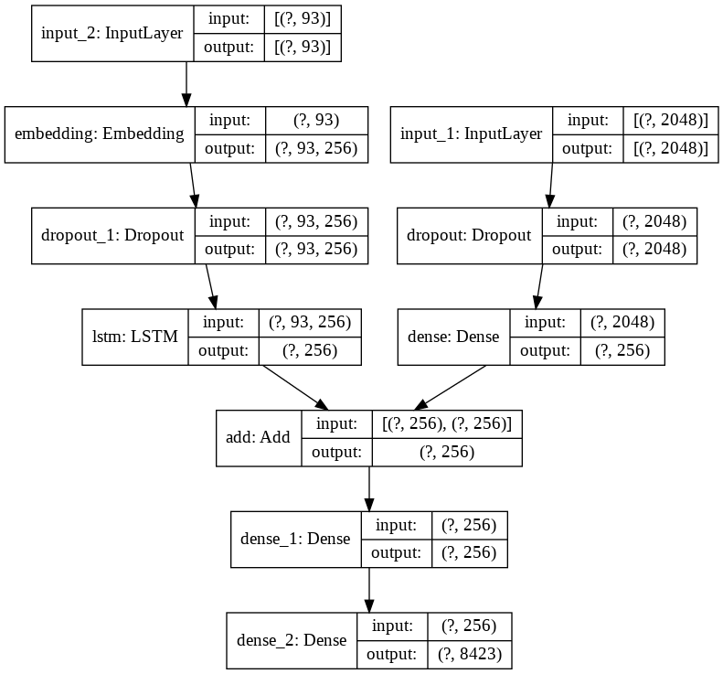

# Image Caption Generator

* This is implementation of a image caption generator which given an image generates a caption based on tit. Image captioning is a challenging task where computer vision and natural language processing both play a part to generate captions. This technology can be used in many new fields like helping visually impaired, medical image analysis, geospatial image analysis etc.

Given an image, generates a caption for it using two different neural networks; Convolutional Neural Network (CNN) and Long Short Term Memory Network (LSTM).

It uses transfer learning using Xception model to leverage the model's trained parameters to encode an image to a 2048 feature vector which is then fed into an LSTM to predict a caption based on the features extracted by Xception.
  

## Flow of the project

**a. Cleaning the caption data**

**b. Extracting features from images using VGG-16**

**c. Merging the captions and images**

**d. Building LSTM model for training**

**e  Predicting on test data**

**f. Evaluating the captions using BLEU scores as the metric**

## Model Architecture
 

</img>
  

- We remove the last layer of Xception network
- Image is fed into this modified network to generate a 2048 length encoding corresponding to it
- The 2048 length vector is then fed into a second neural network along with a caption for the image (while training)
- This second network consists of an LSTM which tries to generate a caption for the image
  

## What is encoder in such models?
The neural networks that changes any input in its features representation i.e vector of numbers is encoder. For example, we want to use image to predict words. As image directly can't tell what should be the word, we want to use its feature to help us decide the next word. And thus the network of layers used to change image or any other type of input in its feature representation is known as encoders.

## What is decoder?
The combination of layers/neural network that takes feature representation provided by encoder as its own input and predicts the next word, is known as decoder

## Steps to follow:

### 1. Cleaning the captions
This is the first step of data pre-processing. The captions contain regular expressions, numbers and other stop words which need to be cleaned before they are fed to the model for further training.

### 2. Extracting features from images
* After dealing with the captions we then go ahead with processing the images. For this we make use of the pre-trained  [VGG-16](https://github.com/fchollet/deep-learning-models/releases/download/v0.1/vgg16_weights_tf_dim_ordering_tf_kernels.h5) weights.
* Instead of using this pre-trained model for image classification as it was intended to be used. We just use it for extracting the features from the images. In order to do that we need to get rid of the last output layer from the model. The model then generates **4096** features from taking images of size (224,224,3).

 

### 4. Viewing similar images
When the VGG-16 model finishes extracting features from all the images from the dataset, similar images from the clusters are displayed together to see if the VGG-16 model has extracted the features correctly and we are able to see them together.

 

### 5. Merging the caption with the respective images
* The next step involves merging the captions with the respective images so that they can be used for training. Here we are only taking the first caption of each image from the dataset as it becomes complicated to train with all 5 of them. 
* Then we have to tokenize all the captions before feeding it to the model.

### 6. Splitting the data for training and testing
The tokenized captions along with the image data are split into training, test and validation sets as required and are then pre-processed as required for the input for the model.

### 7. Building the LSTM model

 
LSTM model is been used beacuse it takes into consideration the state of the previous cell's output and the present cell's input for the current output. This is useful while generating the captions for the images. 
The step involves building the LSTM model with two or three input layers and one output layer where the captions are generated. The model can be trained with various number of nodes and layers. We start with 256 and try out with 512 and 1024. Various hyperparameters are used to tune the model to generate acceptable captions

 

### 8. Predicting on the test dataset and evaluating using BLEU scores
After the model is trained, it is tested on test dataset to see how it performs on caption generation for just 5 images. If the captions are acceptable then captions are generated for the whole test data. 

 

These generated captions are compared to the actual captions from the dataset and evaluated using [BLEU](https://machinelearningmastery.com/calculate-bleu-score-for-text-python) scores as the evaluation metrics. A score closer to 1 indicates that the predicted and actual captions are very similar. As the scores are calculated for the whole test data, we get a mean value which includes good and not so good captions. Some of the examples can be seen below:

## Examples

Here are some captions generated by the network:
 

  

