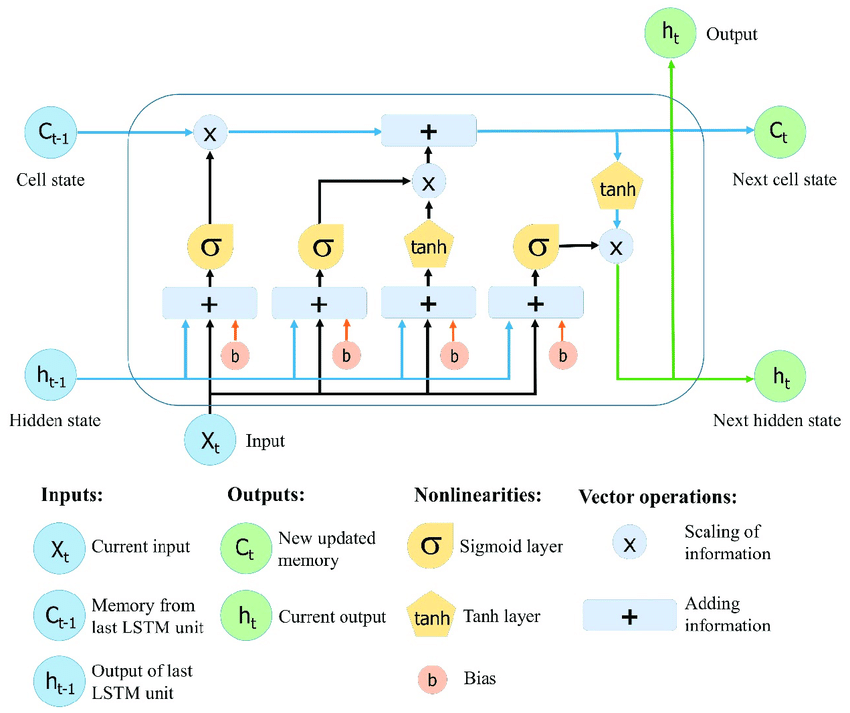
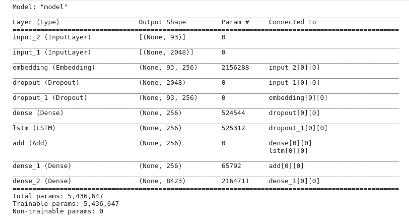

# Image Caption Generator

* This is implementation of a image caption generator which given an image generates a caption based on it. Image captioning is a challenging task where computer vision and natural language processing both play a part to generate captions. This technology can be used in many new fields like helping visually impaired, medical image analysis, geospatial image analysis etc.

* It uses transfer learning using Xception model to leverage the model's trained parameters to encode an image to a 2048 feature vector which is then fed into an LSTM to predict a caption based on the features extracted by Xception.
  

## Flow of the project

**a. Cleaning the caption data**

**b. Extracting features from images using VGG-16**

**c. Merging the captions and images**

**d. Building LSTM model for training**

**e  Predicting on test data**

## Model Architecture

</img>

## What is encoder in such models?
The neural networks that changes any input in its features representation i.e vector of numbers is encoder. For example, we want to use image to predict words. As image directly can't tell what should be the word, we want to use its feature to help us decide the next word. And thus the network of layers used to change image or any other type of input in its feature representation is known as encoders.

## What is decoder?
The combination of layers/neural network that takes feature representation provided by encoder as its own input and predicts the next word, is known as decoder

## Steps to follow:

### 1. Cleaning the captions
* This is the first step of data pre-processing. The captions contain regular expressions, numbers and other stop words which need to be cleaned before they are fed to the model for further training.

### 2. Extracting features from images

* After dealing with the captions we then go ahead with processing the images. For this we make use of the pre-trained weights with Xception model.
* Image is fed into this modified network to generate a 2048 length encoding corresponding to it.

### 5. Merging the caption with the respective images

* The next step involves merging the captions with the respective images so that they can be used for training. Here we are only taking the first caption of each image from the dataset as it becomes complicated to train with all 5 of them. 
* Then we have to tokenize all the captions before feeding it to the model.

### 6. Splitting the data for training and testing
* The tokenized captions along with the image data are split into training, test and validation sets as required and are then pre-processed as required for the input for the model.

### 7. Building the LSTM model

* LSTM model is been used beacuse it takes into consideration the state of the previous cell's output and the present cell's input for the current output. This is useful while generating the captions for the images.
* The step involves building the LSTM model with two or three input layers and one output layer where the captions are generated. The model can be trained with various number of nodes and layers. We start with 256 and try out with 512 and 1024. Various hyperparameters are used to tune the model to generate acceptable captions

### 8. Predicting on the test dataset 
* The trained model is then used to predict captions on the test image dataset. 

* Here are some captions generated by the network:
 

